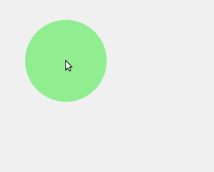
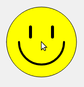
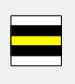
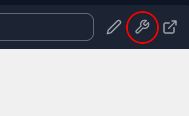
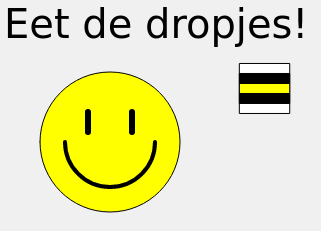
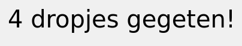
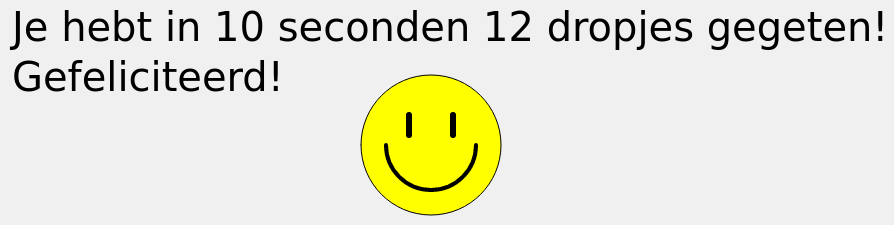

# Candy Crave

JavaScript is een van de populairste programmeertalen ter wereld.

Je kunt van alles met JavaScript-code, maar vandaag gaan we leren hoe je een simpel spelletje kunt maken.


## Open het voorbeeldproject

Er zijn twee manieren om het voorbeeldproject te openen en aan de slag te gaan.

### Manier 1: bewerken in de browser (Replit)

De makkelijkste manier is op de website Replit. Je hebt hiervoor wel een (gratis) account nodig.

> Heb je nog geen account? Klik op **Sign up** (inschrijven) rechtsboven. Je moet dan een gebruikersnaam en een wachtwoord kiezen en je e-mailadres opgeven. Je ontvangt een mailtje en moet klikken op een link in dat mailtje om je account te activeren.

Als je een account hebt en ingelogd bent, kun je het project <a target="_blank" href="https://replit.com/@JanNiestadt/Creatief-Coderen-1-Candy-Crave#script.js">openen</a>.

Klik nu op de blauwe knop met de tekst **Fork repl** rechtsboven. Je kunt nu zelf aan de slag in een kopie van het voorbeeldproject.

Als je iets wijzigt, kun je het programma uitvoeren door op groene knop **Run** (uitvoeren) bovenin te klikken.


### Manier 2: Bewerken met een teksteditor zoals Kladblok

Als je geen account kunt of wilt maken op replit.com, kun je ook gewoon in een teksteditor zoals Kladblok of <a target="_blank" href="https://notepad-plus-plus.org/downloads/">Notepad++</a> werken.

[Download](./1-cirkel-volgt-muis/candy-crave-project.zip) het voorbeeldproject, pak het zipbestand uit op een handige plaats (bijvoorbeeld het bureaublad) en open `index.html` in de browser. Om het programma te bewerken, open je `script.js` in je teksteditor.

Elke keer als je een wijzing maakt, sla het het script op (<kbd>Ctrl+S</kbd>), ga je naar de browser en herlaad je de pagina (<kbd>F5</kbd>).


## Je eerste JavaScript-programma



Bekijk het bestandje `script.js` en voer het uit (klik op de **Run** knop). Beweeg de muiscursor over het venster. Als het goed is, zie je een groene cirkel die de muiscursor volgt.

Begrijp je hoe dit programma werkt? Nee? Laten we kijken of we erachter kunnen komen. Verderop vind je ook een lijst waarin alle termen staan uitgelegd.


### Probeer iets uit!

Als je het programma verandert, zie je vanzelf hoe het werkt. Steeds als je iets hebt veranderd, moet je op "Run" klikken om het programma opnieuw uit te voeren.


Wat je bijvoorbeeld kunt proberen:
- Zet twee schuine strepen `//` voor een van de regels, dus bijvoorbeeld: `//noStroke()`. De regel wordt grijs. Klik nu weer op Run.<br>Wat is er anders geworden? Probeer dit ook bij andere regels. Wat denk je dat `//` aan het begin van de regel doet?
- Probeer andere kleuren bij `background('gray')`, of de regels met `fill(...)`, bijvoorbeeld `'purple'` (paars) of `'green'` (groen). Meer (Engelse) kleurnamen vind je <a target="_blank" href="https://www.w3schools.com/tags/ref_colornames.asp">hier</a>.
- Maak van `mouseY` eens `mouseY - 50` of `mouseY + 50`. Wat gebeurt er nu? En wat als je `(mouseX, mouseY)` vervangt door `(width-mouseX, height-mouseY)`?
- Wat gebeurt er als je `mouseX` weghaalt en vervangt door alleen een getal, bijvoorbeeld `200`? Probeer dit ook met `mouseY`. Wat denk je dat `mouseX` en `mouseY` betekenen?
- Werkt het programma nog als je `mouseX` verandert in `mousex` (dus met een kleine letter `x`)?
- Wat kun je zelf nog bedenken om te veranderen aan het programma?

**Foutje?** Als iets ongedaan wilt maken, gebruik dan <kbd>Ctrl+Z</kbd> (houd <kbd>Ctrl</kbd> ingedrukt en druk (een paar keer) op <kbd>Z</kbd>).


## Meer tekenen

Je begrijpt het programma nu een beetje. Laten we nu kijken of we de cirkel wat meer karakter kunnen geven, door ogen en een mond te tekenen. Straks kun je die zelf aanpassen als je wilt.

Maar eerst gaan we een functie (`function`) maken die ons gezicht tekent. Het is handig om (teken)opdrachten die bij elkaar horen in een functie te verzamelen; die kun je dan bijvoorbeeld meerdere keren uitvoeren, zoals we zometeen zullen doen.

Voeg onderstaande code toe, helemaal onderaan je programma.

> **TIP:** Gebruik kopieren en plakken om code over te nemen: selecteer de code die je wilt overnemen met de muis, druk dan <kbd>Ctrl+C</kbd> (kopieren), klik dan in je programma op de plek waar je de code wilt hebben en druk <kbd>Ctrl+V</kbd> (plakken).

```javascript
// ---------------------------

function tekenSmiley(x, y) {

  // Hoofd
  stroke('black')
  strokeWeight(1)
  fill('yellow')
  circle(x, y, 140)
  
  // Mond
  noFill()
  strokeWeight(4)
  arc(x, y, 90, 90, 0, 180)

  // Ogen
  strokeWeight(6)
  oogLinks = x - 22
  oogRechts = x + 22
  oogBoven = y - 30
  oogOnder = y - 10
  line(oogLinks, oogBoven, oogLinks, oogOnder)
  line(oogRechts, oogBoven, oogRechts, oogOnder)

}

// ---------------------------
```

We hebben nu een nieuwe functie die een smiley tekent, maar we moeten die ook nog gebruiken. Dat noemen we *aanroepen*.

Pas de functie `draw()` aan zodat die de `tekenSmiley()` functie aanroept:

```javascript
//---------------------------

function draw() {

  background(240)
  tekenSmiley(mouseX, mouseY)

}

//---------------------------
```



We stoppen de positie van de muiscursor, `mouseX` en `mouseY`, in onze functie `tekenSmiley`. De waardes die een functie meekrijgt heten ook wel *parameters*.

Probeer het programma uit. Zie je de smiley? Begrijp je hoe deze getekend wordt?

### Probeer iets uit!

Probeer te veranderen hoe het gezichtje getekend wordt:

- Wat doen `stroke` en `strokeWeight` denk je? Pas de kleurnaam en de getallen eens aan, klik "Run" en kijk wat er verandert.
- Wat doet de `arc` functie? Waarom staat er `noFill()` vlak voor de `arc` functie gebruikt wordt? Wat als je `noFill()` wijzigt in `fill('white')`? Wijzig ook eens de laatste twee parameters `0` en `180` eens en kijk wat er gebeurt.
- Hoe worden de ogen getekend? Waarvoor dienen de 4 regels die de variabelen `oogLinks`, `oogRechts`, etc. zetten? Ze worden weer gebruikt in de twee `line` regels; begrijp je hoe het werkt? Kun je de ogen verder uit elkaar zetten? Of er cirkeltjes van maken?
- Wat wil jij nog veranderen aan het gezicht? Een neus, andere ogen, oren, snorharen, hoorntjes of een hoedje?<br>**TIP:** je kunt ook de functie <nobr><code>triangle( x,y, x+10,y+10, x-10,y+10 )</code></nobr> gebruiken, die een driehoek tekent. Zet wel eerst een andere `fill('kleur')`, anders zie je de driehoek misschien niet tegen de achtergrond.

Pas de functie `draw()` nu nog eens aan:

```javascript
//---------------------------

function draw() {

  background(240)
  tekenSmiley(mouseX, mouseY)
  tekenSmiley(mouseX + 140, mouseY)
  tekenSmiley(mouseX, mouseY - 140)

}

//---------------------------
```

Wat gebeurt er nu? Snap je hoe dat komt? En snap je nu waarom het handig kan zijn om sommige opdrachten te verzamelen in een `function`?

Verwijder de twee extra `tekenSmiley` regels nu weer.


## Engelse drop!

Als we een spel willen maken, hebben we wel een doel nodig. Bijvoorbeeld om zo veel mogelijk Engelse drop te eten.

Laten we eerst een functie maken die een Engels dropje tekent:

```javascript
// ---------------------------

function tekenDrop(x, y) {
  stroke('black')
  strokeWeight(1)
  fill('white')
  rect(x - 25, y - 25, 50, 50)
  fill('black')
  rect(x - 25, y - 15, 50, 10)
  rect(x - 25, y + 5, 50, 10)
  fill('yellow')
  rect(x - 25, y - 5, 50, 10)
}

// ---------------------------
```



We gebruiken hier de functie `rect(x, y, breedte, hoogte)` die een rechthoek tekent.

(Dit is maar 1 soort Engelse drop, maar verderop gaan we nog andere soorten toevoegen. Natuurlijk kun je nu al zelf een ander soort dropje tekenen als je wilt. Of heel iets anders.)

Nu willen we dat het dropje op een willekeurige plek op het scherm verschijnt. Een willekeurig getal kiezen kan met de `random(min, max)` functie. Deze functie kiest een getal tussen de twee getallen die je opgeeft.

Zet deze regels aan het eind van de `setup()` functie (maar wel binnen de `{ }`):

```javascript
  // Kies een plek voor het dropje
  dropX = random(25, width - 25)
  dropY = random(25, height - 25)
```

We kiezen een plaats voor het dropje door twee getallen te kiezen: `dropX`, het aantal pixels (schermpunten) van links, en `dropY`, het aantal pixels van boven. We gebruiken hierbij `width` en `height`; dit staat voor de breedte en hoogte van ons venster. Zo zorgen we dat het dropje niet buiten het venster terechtkomt.

Natuurlijk moeten we het dropje wel tekenen, anders zien we niets. Zet deze regel aan het eind van de `draw()` functie:

```javascript
  tekenDrop(dropX, dropY)
```

Probeer het programma uit. Zie je het dropje?

<blockquote>
  
  <b>LET OP:</b> Replit heeft een "console" waarin je uitleg krijgt als er iets misgaat met je programma. Dat is heel handig, maar het valt wel over je programma heen. Je kunt het uit- en inschakelen met het gereedschap-icoontje rechtsboven (zie plaatje).
  <div style="clear: both;"></div>
</blockquote>

Als je de muiscursor over het dropje beweegt, staat het gezicht dan *voor* of *achter* het dropje? Hoe zou je ervoor kunnen zorgen dat het gezicht altijd over het dropje heen getekend wordt? Denk aan de volgorde waarin ze getekend worden.

Nu hebben we een dropje, maar hoe eten we het op?


## (Dr)opeten

We willen dat het dropje opgegeten wordt zodra de speler (dus de muiscursor) er dichtbij komt. Dan moet er een nieuw dropje geplaatst worden, zodat we kunnen blijven dooreten.

Hiervoor hebben we de `if` instructie nodig, die een stukje code alleen uitvoert als aan een bepaalde voorwaarde voldaan is.

De voorwaarde is hier: "de speler (muiscursor) is dicht bij het dropje". We bepalen dit met de `dist(x1, x2, y1, y2)` functie die de afstand tussen twee punten bepaalt.

Voeg deze regels toe aan de `draw()` functie, vlak voor de regel `tekenDrop(dropX, dropY)`:

```javascript
  // Is de speler dichtbij genoeg om het dropje op te eten?
  if (dist(dropX, dropY, mouseX, mouseY) < 50) {
    // Ja! Maak een nieuw dropje
    dropX = random(25, width - 25)
    dropY = random(75, height - 25)
  }

  tekenDrop(dropX, dropY)
```

Begrijp je wat hier gebeurt? `<` is het "kleiner dan" teken, dus er staat eigenlijk "afstand tussen dropje en muiscursor is kleiner dan 50 pixels". Alleen als dat waar is, worden de volgende twee regels (tussen de `{` en `}`) uitgevoerd.

Probeer het maar uit! Als het goed is, verschijnt er nu een nieuw dropje zodra de speler dichtbij genoeg komt op het dropje op te eten.

Bij het kiezen van het nieuwe dropje gebruiken we dezelfde twee regels als we al in `setup()` hebben staan:

```javascript
  dropX = random(25, width - 25)
  dropY = random(75, height - 25)
```

Als je op meerdere plekken dezelfde code hebt staan, is het meestal verstandig om deze code te verplaatsen naar een nieuwe functie, en die functie op meerdere plekken aan te roepen. Als je de code dan wilt veranderen, hoeft dat maar op 1 plek.

Kun jij een functie `maakDropje()` maken en die in zowel `setup` als in `draw` aanroepen?

<details>
  <summary>HINT</summary>
  <p>Zo ziet de functie er uit:</p>
  <pre lang='javascript'><code>// -----------------------------

function maakDropje() {
  dropX = random(25, width - 25)
  dropY = random(75, height - 25)
}

// -----------------------------</code></pre>
  <p>Voeg deze functie toe onder de <code>draw()</code> functie en roep 'm aan vanuit <code>setup()</code> en <code>draw()</code>.</p>
</details>

## Instructies tonen



Laten we verder bovenin het venster een boodschap tonen, zodat spelers weten wat de bedoeling is.

Voeg deze regels toe in `draw()`, net onder de `background` regel:

```javascript
  // Tekst bovenin
  noStroke()
  fill('black')
  textSize(24)
  text('Eet de dropjes!', 20, 40)
```

## Meer variatie

We hebben een hoop vitaminen en mineralen nodig om gezond te blijven. Het is dus verstandig om veel verschillende soorten Engelse drop te eten!<sup>*</sup> Laten we er meer toevoegen!
<br><small><i>( <sup>\*</sup>ouders hebben het altijd over groenten en fruit, maar wat weten die er nou van?)</i></small>

Stel dat we 2 soorten Engelse drop willen. Voeg twee regels toe aan de `maakDropje` functie die een willekeurige soort kiest:

```javascript
  soortenDrop = ['zwart met wit', 'laagjes']
  dropSoort = random(soortenDrop) // kies een van de soorten drop
```

Op de eerste regel geef je een lijst van 2 soorten dropjes. Op de tweede regel kies je een willekeurige soort uit die lijst.<br><small>(In latere opdrachten zullen we veel meer met lijsten gaan doen)</small>

Nu moeten we zorgen dat we verschillende dropjes tekenen. Hiervoor gebruiken we weer de `if` instructie, ditmaal om te checken of een variabele (`dropSoort`) een waarde heeft (bijvoorbeeld `'zwart met wit'`). Let op dat vergelijken gebeurt met *twee* isgelijktekens! (`==`)

Pas de `tekenDrop` functie aan zoals hieronder staat (let op, er is een derde parameter `soort` bijgekomen). Of je kunt natuurlijk je eigen variaties tekenen.

```javascript
//---------------------------------

function tekenDrop(x, y, soort) {

  stroke('black')
  strokeWeight(1)

  if (soort == 'zwart met wit') {
    fill('black')
    circle(x, y, 40)
    noStroke()
    fill('white')
    circle(x, y, 32)
  }

  if (soort == 'laagjes') {
    fill('white')
    rect(x - 25, y - 25, 50, 50)
    noStroke()
    fill('black')
    rect(x - 25, y - 15, 50, 10)
    rect(x - 25, y + 5, 50, 10)
    fill('yellow')
    rect(x - 25, y - 5, 50, 10)
  }

}

//---------------------------------
```

Omdat er een derde parameter bijgekomen is, moeten we de aanroep van de functie in `draw()` ook aanpassen:

```javascript
  tekenDrop(dropX, dropY, dropSoort)
```

Probeer het maar uit. Zie je allebei de soorten dropjes voorbij komen?

Kun je zelf nog een derde soort Engelse drop (of iets anders natuurlijk) toevoegen?

Laten we nu gaan bijhouden hoeveel dropjes je gegeten hebt.


## (Dr)optellen

Om de telling bij te houden, hebben we een variabele `aantalGegeten` nodig. Ook willen we de tekst in beeld aanpassen zodra je dropjes eet, om het aantal te tonen.

Voeg deze regels toe aan `setup()`:

```javascript
  tekstBovenaan = 'Eet de dropjes!'
  aantalGegeten = 0
```

En pas in `draw()` de regel die de tekst toont aan:

```javascript
  text(tekstBovenaan, 20, 40)
```

Zodra je een dropje eet, moeten we `aantalGegeten` verhogen en de tekst bijwerken. Kun jij de twee regels hieronder op de juiste plek zetten?

```javascript
    aantalGegeten = aantalGegeten + 1
    tekstBovenaan = aantalGegeten + ' dropjes gegeten!'
```



Als je 1 dropje gegeten hebt, staat er toch "dropje**s**", terwijl het er maar 1 is. Als je wilt, kun je in dat geval een andere tekst tonen, bijvoorbeeld "Lekker dropje, zijn er nog meer?". Dit kun je doen door een `if` instructie toe te voegen na de twee regels hierboven. Als je het leuk vindt, kun je natuurlijk nog meer `if` instructies gebruiken om andere teksten te tonen wanneer je 2, 3, of nog meer dropjes gegeten hebt.


## Eet zo snel mogelijk!

Veel drop eten is niet echt een uitdaging als je er zo lang over kan doen als je wilt. Dus laten we zorgen dat een speler 10 seconden heeft om zo veel mogelijk dropjes te eten. Daarvoor moeten we de speeltijd bijhouden.

De functie `millis()` bepaalt het aantal milliseconden (er gaan 1000 milliseconden in 1 seconde) sinds het programma gestart is. Voeg deze code toe aan de `draw`-functie:

```javascript
  // Hoe lang is het spel bezig?
  tijd = millis() / 1000
  if (tijd < 10) {

    // Het spel is bezig, toon score
    tekstBovenaan = aantalGegeten + ' dropjes gegeten!'

    // Toon ook nog de tijd, op een nieuwe regel
    tekstBovenaan = tekstBovenaan + '\n(tijd: ' +round(tijd, 1) + ' seconden)'

  } else {

    // Het spel is afgelopen; toon de score
    tekstBovenaan = 'Je hebt in 10 seconden ' + aantalGegeten + 
        ' dropjes gegeten!\nGefeliciteerd!'

  }
```

Probeer het uit. Als je een dropje eet, begint de tijd dan mee te lopen? Hoe zou het komen dat de tijd op een nieuwe regel staat?

Zoals je ziet, kun je achter de `}` van een `if`-opdracht het woord `else` ("of anders...") zetten. Daarna volgen tussen `{` en `}` opdrachten die moeten worden uitgevoerd als *niet* aan de voorwaarde van de `if` voldaan is.

Hierboven staat dus: "als er minder dan 10 seconden voorbij zijn, toon dan tijd en score, maar anders (`else`): feliciteer de speler met het resultaat."

Er is een probleem: als er 10 seconden voorbij zijn, kun je dropjes blijven eten en blijft je score oplopen!

We moeten het tekenen en opeten van dropjes alleen uitvoeren als het spel bezig is, en niet meer als het spel is afgelopen.

Hiervoor kunnen we weer gebruik maken van de `if`-opdracht die we hierboven hadden. We breiden deze `if`-opdracht uit zodat er nu dit staat:

```javascript
  if (tijd < 10) {
    // Het spel is bezig. Toon score en tijd.
    tekstBovenaan = aantalGegeten + ' dropjes in ' + round(tijd, 1) + 
        ' seconden'

    // Is de speler dichtbij genoeg om het dropje op te eten?
    if (dist(dropX, dropY, mouseX, mouseY) < 50) {
      // Ja! Tel dropje en werk de tekst bij
      aantalGegeten = aantalGegeten + 1

      // Maak een nieuw dropje
      maakDropje()
    }

    tekenDrop(dropX, dropY, dropSoort)
    
  } else {
    // (dit gedeelte blijft zoals het net was)
  }  
```

Zie je wat we gedaan hebben? We hebben het opeten van het dropje en het tekenen van het dropje binnen de `if`-opdracht gezet, zodat die alleen uitgevoerd wordt als er minder dan 10 seconden voorbij zijn.

Kijk wel uit dat de code die we binnen de `if`-opdracht hebben toegevoegd nu niet twee keer in je programma staat. Verwijder deze code dus buiten de `if`-opdracht.

Probeer het maar uit. Werkt het nu helemaal goed?



Kun je zelf nog varianten op het spel bedenken? Bijvoorbeeld een vies snoepje dat je juist niet moet pakken. Of iets heel anders natuurlijk.

Als je wilt, kun je ook verdergaan met een van de uitdagingen hieronder. Of je kunt kijken naar [andere opdrachten en voorbeeldprogramma's](../) zijn.

## Uitdaging: geluid spelen

Je kunt nog van alles verbeteren aan het spel. Voeg bijvoorbeeld een geluidseffect toe als je een snoepje opeet! Zet wel je volume laag, zodat je anderen niet stoort.

Er staat al een geluidseffect in het project (`geluid/hap.mp3`), maar je kunt ook zelf een geluidseffect zoeken (in `.mp3` formaat) en het aan je project toevoegen met het plus-knopje.

Maak een nieuwe functie die `preload` heet en laad het geluidsbestand met `hap = loadSound('geluid/hap.mp3')`. Gebruik dan in `draw()` de instructie `hap.play()` om het geluid af te spelen als de speler een dropje eet.

Let op: je hoort niets, totdat de speler een keer met de muis geklikt heeft! Probeer het spel dus zo aan te passen dat er eerst staat "Klik om te beginnen", en het spel pas echt begint als de speler met de muis geklikt heeft (gebruik `function mouseClicked() { ... }` om te weten wanneer de speler klikt).

Je moet nu ook de tijdmeting aanpassen, want `millis()` meet vanaf het laden van de pagina, niet vanaf het moment dat de speler met de muis klikt. Zodra de speler de muis klikt, kun je natuurlijk de waarde van `millis()` in een variabele `beginTijd` opslaan, en die gebruiken om te berekenen hoe lang het spel al bezig is.

Dit is misschien best lastig! Als je er niet uitkomt, vraag dan of een mentor wil meekijken.

> **LET OP:** werk je niet via replit.com maar lokaal? Dan kan het zijn dat het geluid niet werkt. Je kunt proberen om de extensie [Web Server for Chrome](https://chrome.google.com/webstore/detail/web-server-for-chrome/ofhbbkphhbklhfoeikjpcbhemlocgigb) te installeren. Klik op de app om hem te starten en kies bij "Choose Folder" de map met jouw bestanden. Je kunt nu testen door naar het webadres http://127.0.0.1:8887 te gaan.


## Uitdaging: de hoogste score onthouden

Zou het niet leuk zijn als de hoogste score onthouden werd, zelfs als je het spel over een tijdje nog eens speelt?

De eerste stap is natuurlijk om de hoogste score bij te houden als je meerdere spelletjes achter elkaar speelt. Lukt het om dit toe te voegen?

Om te zorgen dat de hoogste score bewaard blijft als je de browser sluit of de computer uitschakelt, moet deze worden bewaard. Dat kan met de functies `storeItem()` (bewaar iets) en `getItem()` (haal het weer op).

Als iemand de `hoogsteScore` verbroken heeft, kun je de nieuwe hoogste score zo bewaren in de browser:

```javascript
storeItem('candyCraveHoogsteScore', hoogsteScore)
```

Wanneer het spel begint, kun je de hoogste score van vorige keer zo weer ophalen:

```javascript
hoogsteScore = getItem('candyCraveHoogsteScore') || 0
```

Die `|| 0` aan het eind ziet er een beetje gek uit misschien. Dat betekent: als er nog geen hoogste score bewaard was (bijvoorbeeld omdat iemand het spel voor het eerst speelt), gebruik dan 0 als beginwaarde.

Lukt het nu om de hoogste score te onthouden?


## Lijst van functies, variabelen en termen

Hier zie je alle functies die we hier gebruikt hebben.

Als we het hebben over positie `50, 100` betekent dat: 50 pixels van links en 100 pixels van boven.

Wil je zelf op zoek naar meer functies (en kun je een beetje Engels)? Kijk dan [hier](https://p5js.org/reference/).

| **Functie-aanroep**      | **Wat doet het?**                                      |
| :-- | :-- |
| `angleMode(DEGREES)`     | Stelt in dat hoeken in graden gegeven worden (er gaan 360 graden in een cirkel) |
| `arc(100, 100, 60, 40, 0, 180)` | Tekent een deel van een cirkel of ellips (afgeplatte cirkel). Gebruikt `100,100` als middelpunt. Gebruikt `60` als breedte en `40` als hoogte voor de ellips. Tekent een "taartpunt" van de ellips van `0` tot `180` graden (precies de helft) |
| `background('gray')` of<br>`background(240)`        | Geef het hele canvas een grijze achtergrond (of een andere kleur, zie <a target='_blank' href='https://www.w3schools.com/tags/ref_colornames.asp'>deze kleurnamen</a> |
| `createCanvas(windowWidth, windowHeight)` | Maak een canvas zo groot als het venster |
| `circle(50, 100, 40)`    | Teken een cirkel met grootte `40` met als middelpunt `50, 100` |
| `dist(50, 100, 200, 250)` | De afstand tussen de punten `50,100` en `200,250` |
| `draw()`                 | Alles wat je in deze functie doet, wordt steeds opnieuw uitgevoerd |
| `fill('blue')`           | Teken vormen met blauwe invulling                      |
| `function`               | Gebruik je om een functie te maken: een stukje code dat 1 ding doet en dat je vanaf meerdere plekken in je code kunt uitvoeren |
| `k = getItem('kleur')` | Haal een eerder bewaarde waarde met de naam `kleur` op uit de browser. Dit werkt natuurlijk alleen als je `kleur` eerder hebt bewaard met `storeItem('kleur', k)` |
| `height`                 | Deze variabele is altijd gelijk aan de hoogte van het canvas |
| `line(10, 20, 30, 40)`   | Tekent een lijn tussen de punten `10,20` en `30,40` |
| `geluid = loadSound('geluid/hap.mp3')` | Laad een geluidsbestand (doe dit in de `preload` functie) |
| `millis()`               | Hoe lang het programma al draait (in duizendsten van seconden; dus 2000 is 2 seconden) |
| `mouseClicked()`         | Wat je in deze functie zet, wordt telkens uitgevoerd als er op de pagina geklikt wordt.
| `mouseX, mouseY`         | De positie van de muiscursor (in pixels van links en van boven) |
| `noStroke()`             | Teken vormen zonder lijnen eromheen                    |
| `noFill()`               | Teken vormen zonder invulling |
| `geluid.play()`          | Speel het geluid af (je moet het `geluid` eerst laden met `loadSound()` in de `preload()` functie. Ook moet de speler eerst op de pagina geklikt hebben. |
| `preload()`              | Deze functie wordt net als `setup()` 1x uitgevoerd. Je kunt in deze functie bijvoorbeeld geluidsbestanden inladen. |
| `random(10, 20)`         | Kies een willekeurig getal tussen `10` en `20`. Dit kan ook een breukgetal worden! Als je een geheel getal wilt, gebruik dan `round()` om het af te ronden. |
| `random(['hond', 'kat', 'konijn'])` | Kies een van de dieren uit de lijst. |
| `rect(10, 20, 30, 40)`   | Teken een rechthoek met linkerbovenhoek `10,20` die `30` breed en `40` hoog is |
| `resizeCanvas(windowWidth, windowHeight)`   | Maak het canvas weer zo groot als het venster (wordt meestal aangeroepen vanuit `windowResized()`) |
| `round(0.7)`             | Rond af op een geheel getal (`0.7` wordt afgerond op `1`; `0.3` zou worden afgerond op `0`) |
| `setup()`                | Alles wat je in deze functie doet, wordt in het begin 1x uitgevoerd |
| `storeItem('kleur', k)` | Bewaar de waarde van variabele `k` in de browser onder de naam `kleur`. Je kunt de waarde weer ophalen (ook pas volgende week!) met `getItem('kleur')` |
| `stroke('red')`          | Gebruik rood als lijnkleur om vormen heen |
| `strokeWeight(3)`         | Zet de lijndikte op 3 |
| `text('Hallo', 50, 100)` | Schrijf `Hallo` op positie `50, 100`  |
| `textAlign(LEFT)`        | Tekst links uitlijnen (of RIGHT=rechts, CENTER=midden) |
| `textSize(10)`           | Zet tekstgrootte op 10                                 |
| `triangle(0, 0, 10, 10, 0, 10)`  | Teken een driehoek met als hoekpunten `0,0`, `10,10` en `0,10` |
| `width`                  | Deze variabele is altijd gelijk aan de breedte van het canvas |
| `windowResized()`        | Wat je in deze functie zet, wordt uitgevoerd als het venster van grootte verandert. Meestal zorg je hier dat het canvas dan meeverandert. |
| `windowWidth, windowHeight`     | Grootte van het venster (meestal gelijk aan canvasgrootte, `width/height`) |


## Tussenresultaten

Zit je een beetje vast, en ben je benieuwd hoe je het bijvoorbeeld kunt aanpakken? Hier zijn een aantal tussenresultaten die je kunt gebruiken:

- [Startproject](1-cirkel-volgt-muis/script.js)
- [Smiley](2-smiley/script.js)
- [Dropjes](3-dropjes/scripts.js)
- [Dropjes eten](4-dropjes-eten/script.js)
- [Verschillende dropjes](5-verschillende-dropjes/script.js)
- [Dropjes tellen](6-dropjes-tellen/script.js)
- [Eet zo snel mogelijk](7-eet-zo-snel-mogelijk/script.js)
- [Geluid](8-geluid/script.js)
