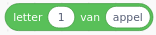

[Creatief Coderen](../) » Vergelijk Scratch met JavaScript

# Vergelijk Scratch met JavaScript

Links zie je Scratch-blokjes en rechts hoe je hetzelfde doet in JavaScript.

<small>(voor sommige dingen zoals tekenen, muis en toetsenbord gebruiken we de [P5](https://p5js.org/) hulpfuncties).</small>

<table class='scratch'>
    <tr>
        <th>Scratch</th>
        <th>JavaScript</th>
    </tr>
    <!-- flag clicked -->
    <tr>
        <td></td>
<td>Zet code die 1x in het begin moet worden uitgevoerd in <code>setup()</code></td>
    </tr>
    <!-- repeat -->
    <tr>
        <td></td>
<td>zet de code die je steeds wilt herhalen in <code>draw()</code></td>
    </tr>
    <!-- assignment -->
    <tr>
        <td></td>
<td><pre lang="javascript">score = 0</pre></td>
    </tr>
    <!-- if -->
    <tr>
        <td></td>
<td><pre lang="javascript">if (x > 50) {
    x = 50
}</pre></td>
    </tr>
    <!-- if/else -->
    <tr>
        <td></td>
<td><pre lang="javascript">if (x > 50) {
    x = 50
} else {
    score = score + 1
}</pre></td>
    </tr>
    <!-- repeat N -->
    <tr>
        <td></td>
<td><pre lang="javascript">tel = 0
while (tel < 10) {
  // (zet hier code die je 10x
  //  wilt uitvoeren)
  tel = tel + 1
}</pre></td>
    </tr>
    <!-- equals -->
    <tr>
        <td></td>
<td><pre lang="javascript">x == 50</pre></td>
    </tr>
    <!-- AND -->
    <tr>
        <td></td>
<td><pre lang="javascript">x == 0 && score > 100</pre></td>
    </tr>
    <!-- OR -->
    <tr>
        <td></td>
<td><pre lang="javascript">x == 0 || score > 100</pre></td>
    </tr>
    <!-- not -->
    <tr>
        <td></td><td><pre lang="javascript">! (x == 0 || score > 100)</pre></td>
</tr>
    <!-- timer -->
    <tr>
        <td></td>
<td><pre lang="javascript">millis() / 1000</pre></td>
    </tr>
    <!-- string concatenate -->
    <tr>
        <td></td>
<td><pre lang="javascript">'appel' + 'banaan'</pre></td>
    </tr>
    <!-- increment -->
    <tr>
        <td></td>
<td><pre lang="javascript">score = score + 1</pre></td>
    </tr>
    <!-- key pressed -->
    <tr>
        <td></td>
<td><pre lang="javascript">function keyPressed() {
  if (key == ' ') {
    // (zet hier wat er moet gebeuren 
    //  wanneer op spatie gedrukt wordt)
  }
  if (keyCode == UP_ARROW) {
    // (zet hier wat er moet gebeuren
    //  wanneer op pijltje omhoog 
    //  gedrukt wordt)
  }
}</pre></td>
    </tr>
    <!-- mouse clicked -->
    <tr>
        <td></td>
<td><pre lang="javascript">function mouseClicked() {
    // (zet hier wat er moet gebeuren
    //  als de muisknop geklikt wordt)
}
</pre></td>
    </tr>
    <!-- mouseX, mouseY -->
    <tr>
        <td> </td>
<td><code>mouseX</code> / <code>mouseY</code></td>
    </tr>
    <!-- ask -->
    <tr>
        <td></td>
<td><pre lang="javascript">antwoord = prompt('Hoe heet je?')
</pre></td>
    </tr>
    <!-- random -->
    <tr>
        <td></td>
<td><pre lang="javascript">random(1, 10)
</pre></td>
    </tr>
    <!-- round -->
    <tr>
        <td></td>
<td><pre lang="javascript">round(x)</pre></td>
    </tr>
    <!-- string contains -->
    <tr>
        <td></td>
<td><pre lang="javascript">'appel'.contains(a)</pre></td>
    </tr>
    <!-- string index -->
    <tr>
        <td></td>
<td><pre lang="javascript">'appel'[0]</pre></td>
    </tr>
    <!-- string length -->
    <tr>
        <td></td>
<td><pre lang="javascript">'appel'.length</pre></td>
    </tr>
</table>

